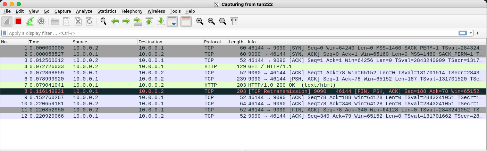
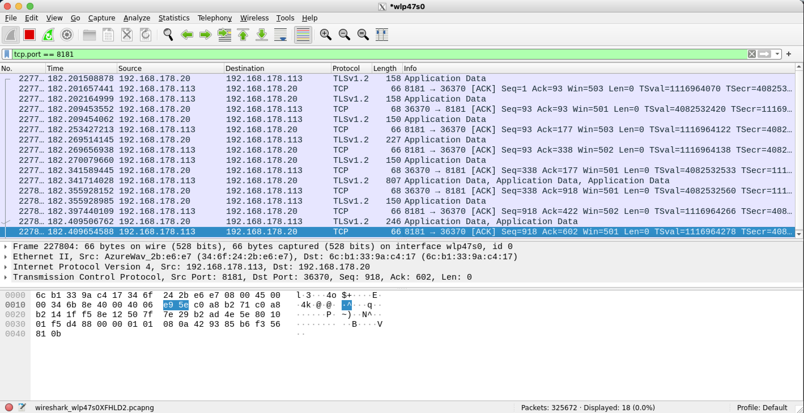

Description:
============

Nnvpn (No Name VPN) is a VPN core implementation. It permits to create an encrypted virtual network between two Linux hosts.

* Endpoints are TUN devices:

* Cryptographic layer uses OpenSSL library:


Prerequisites:
==============

The program is intended to be used in a Linux environment and it is tested using the following Linux distributions:

- Ubuntu 22.04.2 LTS (jammy) for ARM<BR>
- Ubuntu 22.04.2 LTS (jammy) for x86-64<BR>

using, as compiler, one in this list:<BR>

- g++ (Ubuntu 11.3.0-1ubuntu1~22.04.1) 11.3.0  (ARM)<BR>
- g++ (Ubuntu 11.3.0-1ubuntu1~22.04.1) 11.3.0  (x86-64)<BR>

To compile the program, this tools/libraries are necessary:

* a c++ compiler ( with c++20 support);
* automake/autoconf with libtool;

Installation:
=============

- Create config scripts:
```
   make -f makefile.dist
```
- launch the configure script:
```
  ./configure
```
- Compile the program:
```
  make
```
- Install the program and the man page:
```
  sudo make install
```

* set capabilities ( if "make install" is not performed ):
```
  sudo setcap cap_net_admin=ep src/nnvpn
```

Configuration:
==============

* This program use a configuration file using LUA syntax, you can find a template in ./data directory. See man page for details.
* You need OpenSSL certificates: the script createCert.pl is provided as example: it will create certificates with default parameters. A passphrase will be asked as input.

Example:
========

* Client machine:
```
 nnvpn -f /home/test/vpn/data/nnvpn.lua
```

* Server machine: 
  nnvpn -s -f /home/test/vpn/data/nnvpn.lua

* Launching the previous commands, TUN devices will be created on the server and client machine. Each interface requires an IP address and activation, the following example cover this point:
```
sudo ip addr add 10.0.0.1/24 dev tun222
sudo ip link set dev tun222 up 
```

* To test the connectivity, it's possible to use a simple html file:
```
<!DOCTYPE html>
<html>
    <head>
        <title>Tvpn test!</title>
    </head>
    <body>
        <p>If you see me, it works!</p>
    </body>
</html>
```
* Copy this code in a file called "index.html" in a test directory in the SERVER machine;
* Having python3 installed, start the test HTTP server using TUN device IP and a free port port. The shell points to the directory containing "index.html":
```
 python3 -m http.server --bind 10.0.0.1 9090
```
* From the CLIENT machine, we are about to download the test page using curl:
```
curl -v -L 10.0.0.1:9090 
```
  the output, if the test is successful, will be similar to the following:
```
*   Trying 10.0.0.1:9090...
* Connected to 10.0.0.1 (10.0.0.1) port 9090 (#0)
> GET / HTTP/1.1
> Host: 10.0.0.1:9090
> User-Agent: curl/7.81.0
> Accept: */*
> 
* Mark bundle as not supporting multiuse
* HTTP 1.0, assume close after body
< HTTP/1.0 200 OK
< Server: SimpleHTTP/0.6 Python/3.10.12
< Date: Sun, 22 Oct 2023 03:28:17 GMT
< Content-type: text/html
< Content-Length: 151
< Last-Modified: Sun, 22 Oct 2023 03:11:11 GMT
< 
<!DOCTYPE html>
<html>
    <head>
        <title>Tvpn test!</title>
    </head>
    <body>
        <p>If you see me, it works!</p>
    </body>
</html>
* Closing connection 0
```

Log file:
=========

* A log file will be generated with the name specified in configuration file. It contains error or diagnostic messages.

Instructions:
=============

* See the man page included in the release.

License:
========

[* This work is licensed under a Creative Commons Attribution-NonCommercial 4.0 International License](http://creativecommons.org/licenses/by-nc/4.0/)
[](http://creativecommons.org/licenses/by-nc/4.0/)
